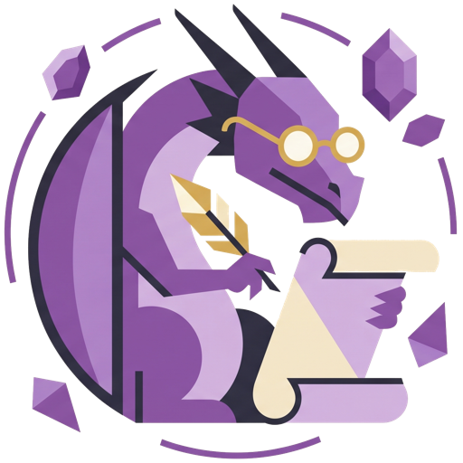

# Getting Started with AMAnuensis

A quick walkthrough of the everyday stuff — bringing in (or creating) a character,
logging games, trading, shopping, and keeping your data safe. AMAnuensis has more
tools than this (magic item prep, spell copying, printable reports…), but this covers
what you'll actually touch most sessions.

Everything here lives **only in your browser** — there's no account and no server.
That makes backups important; see the last section.

## 1. Already playing? Import your history

Most players already have some history somewhere — you probably don't need to start
from zero. Two shortcuts on the Characters screen:

- **Import AL Log** — you've been logging games on
  [adventurersleaguelog.com](https://www.adventurersleaguelog.com). Pick your
  exported CSV (one file per character).
- **Import CSV Log** — your history lives somewhere else entirely: a personal
  spreadsheet, any other CSV export the app has never seen before.

Both work the same way: pick your file, and AMAnuensis converts it into a brand-new
character with all its logs. Import AL Log knows the site's format well enough to
offer an instant offline conversion (**✨ Quick Import**), but for anything trickier —
or for Import CSV Log, which has to work out formats it's never seen — the more
accurate path is **🤖 Use an AI Chatbot**: click it, copy the prepared instructions
(your file's contents are included), paste them into any AI chatbot you already use
(ChatGPT, Claude, Gemini…), and paste its reply back in.

Either way, nothing is saved right away — you get a preview first (derived level, GP,
downtime, and a list of anything the conversion wasn't sure about) so you can check it
over. Importing always creates a **brand-new** character; it never touches or
overwrites anything already in the app.

Starting completely fresh instead? Read on.

## 2. Starting fresh: create your character

*(Already imported a character in Step 1? Skip to Step 4.)*

On the Characters screen, click **+ New Character** and enter a name, species, and
class (species/class are just labels you type — nothing mechanical depends on them).

A brand-new character starts at **Level 1** with **0 GP** and an empty inventory —
everything else comes from logs you add. So the very next thing you do is add your
first log.

## 3. Starting fresh: your first log (Starting Log)

*(Already imported a character in Step 1? Skip to Step 4.)*

Open the character and click **+ Add Log**, then pick the **Starting Log** tab. This
is where you record how the character began:

- **Starting level** — most tables start at 1, but pick higher if yours allows
  starting further along (some AL rules grant extra downtime or even a free magic
  item at higher starting levels — there are fields for both).
- **Background** and **Class** — pick your 2024 PHB packages and AMAnuensis fills in
  the starting gold and equipment for you (sum of both picks). Everything it fills in
  stays editable, so swap out an "(any)" placeholder for the specific tool/instrument
  you chose, or pick **Custom Background** and enter your own gold/gear.

Save it, and the character sheet immediately shows the right level, GP, and starting
inventory.

## 4. Logging a session

This is the log you'll use most. After a game, click **+ Add Log → Session** and fill in:

- **GP gained/lost**, **Downtime gained**, **Level gained** (usually +1)
- **DM** and **Location** (dropdowns remember names you've used before)
- **Items gained** — pick from the catalog or type a name; magic items get their own
  picker with rarity and attunement
- **Items lost** — anything used up or given away mid-session

> **Tip:** If your DM posts a written recap (e.g. on Discord), click
> **+ Add Log from Text** instead of filling the form by hand — paste the recap in
> and it prefills a Session log for you to review before saving.

## 5. Trading a magic item

Trading with another player costs **5 downtime days** and only works between items of
the **same rarity**. Click **+ Add Log → Trade**, pick the magic item you're giving
away from your inventory, type in what you received (with its rarity, matched
automatically to what you gave up), and who you traded with.

## 6. Buying (and selling) gear

**Purchase** logs spend GP on equipment or consumables — pick items from the catalog
(prices fill in automatically) or type your own; the total GP spent is calculated for
you as you add rows.

Selling gear back works the same way in reverse — there's a matching **Sell** log
type for that, prefilled from what you originally paid.

## 7. Catching up on levels

Behind on levels compared to your table? A **Catch Up** log spends **10 downtime days
per level** — set how many levels to gain and the downtime cost is calculated for you.

## 8. Made a mistake? Just fix the log

Nothing here is permanent in a scary way. Every stat on the character sheet — level,
GP, downtime, inventory — is **recalculated from your logs every time**, not stored
directly. So:

- Click **✎** on any log to edit it — fix the numbers, and everything recomputes.
- Click **✕** to delete a log entirely if it shouldn't exist.

There's no way to corrupt your character by editing history — worst case, you delete
a log and re-add it correctly.

## 9. Back up your data

Since everything lives in your browser only, **your backup file is your only copy** —
clearing browser data or switching devices without one means starting over. In the
header:

- **Backup All** downloads everything (every character, every log) as a JSON file.
- **Restore All** loads a backup back in — you'll be asked whether to *replace*
  everything or *merge* it with what's already there.

AMAnuensis tracks changes since your last backup and shows a reminder in the
bottom-left corner ("You have unexported changes") with a **Backup now** shortcut
until you download one.

---

That's enough to bring in a character and keep playing. When you're ready to dig
further — magic item attunement and prep for game night, copying spells into a
Wizard's spellbook, or printing a report for your DM — those tools are all there in
the app when you need them.
